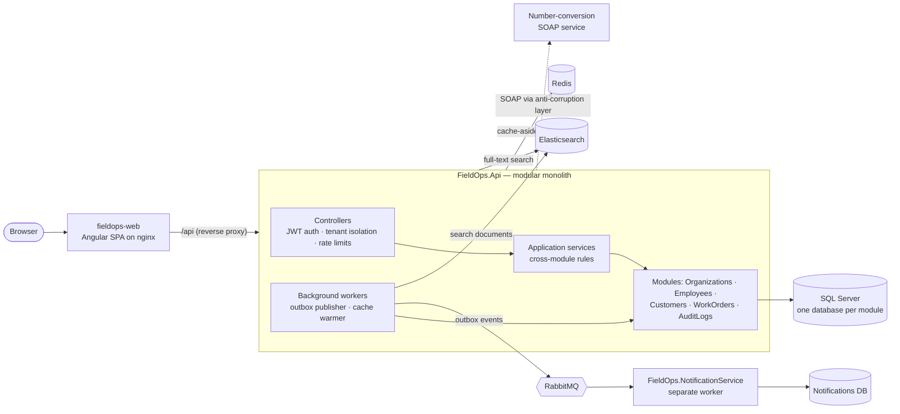

# FieldOps Operations Platform

A .NET 10 backend portfolio built around **FieldOps**, a multi-tenant field-service management platform, plus two smaller supporting applications. FieldOps starts as a modular monolith and grows into a distributed system with messaging, search, observability, an Angular frontend, and Kubernetes deployment manifests.

**Highlights**

* **Runs from a clean machine** — one `docker compose up`, one migration loop, then the [API examples](#api-examples) below; every documented command was re-run against a freshly created stack.
* **Secure by default** — every endpoint requires a JWT unless explicitly marked anonymous; tenant and identity come only from token claims; an [OWASP Top 10 self-review](docs/SECURITY_REVIEW.md) lists what was fixed and what is still open.
* **Measured, not assumed** — k6 load tests, an index chosen from execution plans, and a thread-pool hang found with `dotnet-stack` instead of guessed.
* **Reliable messaging** — transactional outbox, idempotent inbox consumers, and a dead-letter queue between the API and a separately deployable notification service.
* **Tested at the right level** — unit tests for business rules; integration tests against real SQL Server through Testcontainers; Angular tests with Vitest; a smoke test in CI.
* **Decisions written down** — [architecture decision records](docs/adr) and "Day N" comments explain why the code looks the way it does.

## Projects

| Project | Type | Highlights |
|---|---|---|
| **FieldOps** | Modular monolith + extracted service + Angular frontend | Multi-tenancy, database-per-module, Redis caching, RabbitMQ with outbox/inbox, Elasticsearch, OpenTelemetry, Polly resilience, JWT, Docker, Kubernetes |
| **StockPilot** | ASP.NET Core Web API | JWT access/refresh tokens with rotation, role- and policy-based authorization, optimistic concurrency, Testcontainers integration tests |
| **RoadmapOS** | ASP.NET Core MVC | Server-rendered CRUD, EF Core relationships, a progress dashboard |

## Tech stack

* .NET 10, ASP.NET Core (controller-based APIs, MVC), C# with nullable reference types
* Entity Framework Core, SQL Server
* Redis, RabbitMQ, Elasticsearch
* OpenTelemetry (tracing, metrics), Polly (timeouts, circuit breaker)
* xUnit, Testcontainers
* Angular 22 (standalone components, signals, reactive forms)
* Docker, Docker Compose, Kubernetes, GitHub Actions

---

## FieldOps

FieldOps manages organizations, employees, customers, and work orders for field-service teams.

### Architecture



A request goes browser → nginx (`/api`) → controller (token validated, tenant taken from its claims) → application service → module → its own SQL Server database. Redis, RabbitMQ and Elasticsearch are optional at runtime: when they are down, the API keeps serving and degrades (no cache, delayed messages, no search).

* **Modular monolith** — five modules (Organizations, Employees, Customers, Work Orders, Audit Logs), each a separate class library with `internal` domain entities and its **own SQL Server database**, exposing only a public interface and DTOs to the host API. Cross-module references are validated in application code, not by foreign keys (see [ADR 0003](docs/adr/0003-database-per-module.md)).
* **Work order lifecycle** — Open → Assigned → InProgress → Completed, with reassignment, reopening, and customer approval, guarded by tenant isolation and role/ownership checks on every action.
* **Caching** — a Redis cache-aside status report with explicit invalidation and a background cache warmer.
* **Messaging** — completing a work order writes an **outbox** row in the same transaction as the state change; a background publisher delivers it to RabbitMQ and retries until it succeeds. Consumers use an **inbox** table for idempotency, exponential-backoff reconnects, and a dead-letter queue for unprocessable messages.
* **Notification service** — a separately deployable .NET worker service (`FieldOps.NotificationService`) with no compile-time dependency on the API, consuming work-order events over RabbitMQ ([ADR 0005](docs/adr/0005-notification-service-boundary.md)).
* **Search** — work orders are mirrored into Elasticsearch (via the same outbox) for tenant-filtered full-text search, with a per-organization index rebuild endpoint. SQL Server remains the source of truth.
* **External integration** — a SOAP service consumed behind an anti-corruption layer ([ADR 0009](docs/adr/0009-anti-corruption-layer.md)).
* **Observability and resilience** — structured JSON logging with correlation IDs, OpenTelemetry distributed tracing propagated through RabbitMQ message headers, custom metrics (including outbox publish lag), `/health/live` and `/health/ready` endpoints, and a Polly timeout + circuit breaker around Elasticsearch.
* **Cross-cutting** — per-organization rate limiting, idempotency keys, audit logging, and an `IAiProvider` abstraction for summarizing work-order evidence notes.
* **Security** — JWT required on every endpoint by default; identity and tenant come from validated token claims; PBKDF2-hashed passwords with uniform login failures; rate limits per tenant and per login client; ProblemDetails errors without internals; security events logged. See the [security self-review](docs/SECURITY_REVIEW.md).
* **Performance and resilience under load** — organization filtering and counting in SQL with a measured `(OrganizationId, Status)` index, paginated lists, async I/O end to end on the hot paths, transient-fault retries for SQL Server, fail-fast Redis. k6 load tests live in [`tests/load`](tests/load).

A [five-minute demo script](docs/DEMO_SCRIPT.md) walks through the system live; the [architecture retrospective](docs/ARCHITECTURE_RETROSPECTIVE.md) maps every boundary and abstraction to the problem it solved and its industry name, and the interview notes answer common [C#/ASP.NET Core](docs/interview/csharp-aspnetcore.md) and [SQL/EF Core/distributed-systems](docs/interview/data-and-distributed.md) questions from this code. Architecture decisions are recorded in [docs/adr](docs/adr); each was reviewed against the code on Day 126 and carries a "Later Developments" section where reality moved on:

| ADR | Decision |
|---|---|
| [0001](docs/adr/0001-modular-monolith-one-way-dependencies.md) | Modular monolith; modules never reference the host or each other |
| [0002](docs/adr/0002-cross-module-references-via-host-orchestration.md) | Cross-module rules live in the host (application services) |
| [0003](docs/adr/0003-database-per-module.md) | Each module owns its own database |
| [0004](docs/adr/0004-domain-events-vs-integration-events.md) | Domain versus integration events, and when one becomes the other |
| [0005](docs/adr/0005-notification-service-boundary.md) | The notification service's boundary and data ownership |
| [0006](docs/adr/0006-rest-vs-messaging.md) | REST for questions that need an answer now, messaging for announced facts |
| [0007](docs/adr/0007-independent-deployment.md) | One Compose file is not independent deployment |
| [0008](docs/adr/0008-soap-integration-boundary.md) | SOAP stays behind its own boundary |
| [0009](docs/adr/0009-anti-corruption-layer.md) | What counts as an anti-corruption layer |
| [0010](docs/adr/0010-identity-and-tenant-from-token-claims.md) | Identity and tenant only from token claims; secure by default |
| [0011](docs/adr/0011-optional-infrastructure-degrades.md) | SQL Server is essential; Redis, RabbitMQ and Elasticsearch degrade |

Code comments often begin with "Day N": this repository was built as a day-by-day learning project, and those comments record why each decision was made at the time.

### Running it with Docker Compose

```
cp .env.example .env
# edit .env and set a real SA_PASSWORD
docker compose up --build -d --wait
```

This starts SQL Server, Redis, RabbitMQ, Elasticsearch, the API, and the notification service; `--wait` returns only when SQL Server's health check passes (it accepts logins), so the next step cannot race its startup. The databases are not created automatically: apply the migrations of the five modules **and of the notification service** against the containerized SQL Server (exposed on `localhost,14330`). Requires the .NET 10 SDK and the `dotnet-ef` tool (`dotnet tool install --global dotnet-ef`).

```
SA_PASSWORD='<your SA_PASSWORD>'
for target in Modules.Organizations:FieldOpsOrganizations Modules.Employees:FieldOpsEmployees \
              Modules.WorkOrders:FieldOpsWorkOrders Modules.Customers:FieldOpsCustomers \
              Modules.AuditLogs:FieldOpsAuditLogs NotificationService:FieldOpsNotifications; do
  dotnet ef database update --project "src/FieldOps.${target%%:*}" \
    --connection "Server=localhost,14330;Database=${target##*:};User Id=sa;Password=$SA_PASSWORD;TrustServerCertificate=True;"
done
```

Without the notification service's database the API still works, but the notification service fails every completed-work-order event with `Cannot open database "FieldOpsNotifications"`.

Then check:

* `http://localhost:5190/health/ready` — dependency health (anonymous)
* every other endpoint requires a bearer token from `POST /api/auth/login` — see the API examples below

Tear down with `docker compose down`. The Compose file uses no named volumes, so this also deletes the databases; the migrations must be applied again after the next `up`.

### Seeded demo identities

Employees log in with their id and password and send the returned JWT as a bearer token; the API takes the caller's organization and role from the token. Every seeded employee has the **local demo password `FieldOps-Demo-2026!`** — for local development only; never deploy the seed data with it. Customer approval still identifies the customer with an `X-Customer-Id` header (customers cannot log in yet).

| Organization | Employee (Admin) | Employee (Member) | Customer |
|---|---|---|---|
| 1 | id `1` | id `2` | id `1` |
| 2 | id `3` | id `4` | — |

Login is rate limited (5 attempts per minute per client address; the sixth returns `429`, successful logins included) and returns the same 401 for an unknown employee and a wrong password. Tokens are valid for an hour, so log in once and reuse them.

### API examples

Run against the Docker Compose stack above (bash; every command and status code below was checked against a freshly created stack).

```
API=http://localhost:5190
login() { curl -s -X POST $API/api/auth/login -H "Content-Type: application/json" \
  -d "{\"employeeId\":$1,\"password\":\"FieldOps-Demo-2026!\"}" | sed -E 's/.*"token":"([^"]+)".*/\1/'; }
ADMIN=$(login 1)    # Admin of organization 1
MEMBER=$(login 2)   # Member of organization 1

# create (201) — the response contains the new work order's id
curl -X POST $API/api/workorders -H "Authorization: Bearer $ADMIN" \
  -H "Content-Type: application/json" -d '{"title":"Fix the HVAC unit","customerId":1}'
ID=1   # the id returned above

# lifecycle: the Admin assigns, the assigned Member starts and completes (200 each)
curl -X POST $API/api/workorders/$ID/assign -H "Authorization: Bearer $ADMIN" \
  -H "Content-Type: application/json" -d '{"employeeId":2}'
curl -X POST $API/api/workorders/$ID/start    -H "Authorization: Bearer $MEMBER"
curl -X POST $API/api/workorders/$ID/complete -H "Authorization: Bearer $MEMBER"

# reads (200): a page of work orders, one work order, the status report, the caller's organization
curl "$API/api/workorders?page=1&pageSize=10" -H "Authorization: Bearer $ADMIN"
curl $API/api/workorders/$ID                  -H "Authorization: Bearer $ADMIN"
curl $API/api/workorders/report               -H "Authorization: Bearer $ADMIN"
curl $API/api/organizations                   -H "Authorization: Bearer $ADMIN"
```

Error cases (all return ProblemDetails bodies):

| Request | Status |
|---|---|
| any endpoint without a token | `401` |
| login with a wrong password (or an unknown employee) | `401` |
| organization 2's Admin (`login 3`) reads organization 1's work order | `404` — other tenants' data is indistinguishable from missing data |
| a Member tries to assign a work order | `403` |
| `GET /api/workorders?pageSize=500` | `400` — page size is capped |

Completing a work order also publishes an event through the outbox. For a work order with a customer, `docker compose logs fieldops-notification-service` then shows `Notification: Work order 'Fix the HVAC unit' has been completed and is awaiting your approval.` (work orders without a customer are consumed silently: there is no one to notify).

### Angular frontend (`src/fieldops-web`)

An Angular 22 app with work order list, detail, create, dashboard, and login screens. It uses standalone components, signals (the app is zoneless), reactive forms, client-side routing, and an HTTP interceptor that attaches a JWT from `POST /api/auth/login` to outgoing requests.

The app calls the API through relative `/api/...` URLs, so it contains no API address and the same build works in every environment:

* **Local development** — `npm start` proxies `/api` to `http://localhost:5138` (see `proxy.conf.json`). Run the API first (`cd src/FieldOps.Api && dotnet run`):

  ```
  cd src/fieldops-web
  npm install
  npm start
  ```

  Then open `http://localhost:4200`.
* **Container** — nginx serves the app and reverse-proxies `/api` to the address in the `API_UPSTREAM` environment variable (rendered into the nginx config at container start from `nginx.conf.template`). Without it, the container still starts and `/api` returns `502`.

### Kubernetes (`k8s/`)

* **Frontend** — a Deployment (liveness and readiness probes), a ClusterIP Service, and a HorizontalPodAutoscaler scaling between 2 and 6 replicas on CPU utilization (requires metrics-server). The image is a multi-stage build (Node build stage → nginx) with a client-side-routing fallback.
* **API** — a Deployment and Service configured through a ConfigMap (non-secret settings) and a Secret (connection strings). Readiness targets `/health/ready` (SQL Server and Redis reachability), liveness targets `/health/live` (no external checks), so a dependency outage takes the Pod out of traffic without restarting it. The dependencies run under Docker Compose on the host and are reached via `host.docker.internal`.

```
# frontend
docker build -t fieldops-web:day105 src/fieldops-web
kubectl apply -f k8s/fieldops-web-deployment.yaml -f k8s/fieldops-web-service.yaml -f k8s/fieldops-web-hpa.yaml

# API (dependencies first: docker compose up -d sqlserver redis rabbitmq elasticsearch, then migrations)
docker build -t fieldops-api:day101 .
kubectl create secret generic fieldops-api-secrets \
  --from-literal=ConnectionStrings__FieldOpsWorkOrdersDb="Server=host.docker.internal,14330;Database=FieldOpsWorkOrders;User Id=sa;Password=<SA_PASSWORD>;TrustServerCertificate=True;"
  # ...one --from-literal per module (Organizations, Employees, WorkOrders, Customers, AuditLogs)
kubectl apply -f k8s/fieldops-api-configmap.yaml -f k8s/fieldops-api-deployment.yaml
kubectl port-forward svc/fieldops-api 8084:80
```

The Secret is created from the command line on purpose: Kubernetes Secrets are only base64-encoded, so no Secret manifest is committed.

* **Ingress** — a single entry point: `/api/...` routes to the API, everything else to the frontend.

```
# requires an ingress controller; the local setup used ingress-nginx:
kubectl apply -f https://raw.githubusercontent.com/kubernetes/ingress-nginx/controller-v1.15.1/deploy/static/provider/cloud/deploy.yaml
kubectl apply -f k8s/fieldops-ingress.yaml
curl http://localhost/api/health/ready   # routed to the API; other API endpoints need a bearer token
```

ingress-nginx was announced for retirement by the Kubernetes project (March 2026); it is used here only on a local cluster. The Ingress rules themselves are controller-agnostic.

### Running the tests

```
dotnet test FieldOps.slnx          # backend: HTTP integration tests against Testcontainers SQL Server (Docker required)
cd src/fieldops-web && npx ng test # frontend: unit tests (Vitest)
```

### Azure deployment

FieldOps was deployed to **Azure Container Apps** as a demo (October 2026), using the images CI publishes to GHCR, then torn down at the end of the free trial. The setup:

* **Frontend** (`fieldops-web`) — external HTTPS ingress, scales to zero when idle; `API_UPSTREAM=http://fieldops-api` points its nginx reverse proxy at the API.
* **API** (`fieldops-api`) — **internal ingress only**: not reachable from the internet, only through the frontend's `/api`. Connection strings are Container Apps secrets.
* **Database** — five Azure SQL serverless databases (one per module) on the free offer, configured to auto-pause rather than bill when the free monthly limit is exhausted.
* **Migrations** — applied as idempotent SQL scripts generated by `dotnet ef migrations script --idempotent` (safe to re-run; already-applied migrations are skipped).

Redis, RabbitMQ, and Elasticsearch are intentionally not deployed (to stay within free limits): the API keeps working without them, but caching, messaging, notifications, and search are inactive there.

**Deploying a new version and rolling back.** Every image is tagged with its commit SHA, so a deploy and a rollback are the same command with a different tag; each creates a new Container Apps revision:

```bash
az containerapp update --name fieldops-api --resource-group <rg> --image ghcr.io/berkanirez/fieldops-api:<sha>
```

**Verifying a deployment.** [`scripts/smoke-test.sh`](scripts/smoke-test.sh) checks the frontend, an Angular deep link, that the API rejects anonymous calls (401), login, then the API with its database and the report endpoint using the token, all through the public URL. It retries to ride out scale-to-zero cold starts, checks response bodies as well as status codes, and exits `0` (healthy) or `1` (failed):

```bash
scripts/smoke-test.sh https://<frontend-app>.<environment>.azurecontainerapps.io
```

The same script can be run from GitHub: **Actions → Smoke test → Run workflow** ([`.github/workflows/smoke-test.yml`](.github/workflows/smoke-test.yml)) takes the URL as input and fails the job when any check fails.

Logs from the containers go to a Log Analytics workspace (queryable with KQL), and Container Apps exposes request and replica metrics.

### CI/CD

GitHub Actions ([`.github/workflows/ci.yml`](.github/workflows/ci.yml)) runs on every push and pull request:

* **Backend** — builds and tests all three solutions, builds the API image, starts the full Docker Compose stack, applies migrations, and checks `/health/ready`.
* **Frontend** — `npm ci`, unit tests, and a production build of `src/fieldops-web`.
* **Publish** (pushes to `master` only, after both test jobs pass) — builds the API and frontend images and pushes them to GitHub Container Registry as `ghcr.io/berkanirez/fieldops-api` and `ghcr.io/berkanirez/fieldops-web`, each tagged with the short commit SHA and `latest`.

### Known limitations

A security self-review against the OWASP Top 10, with reproducible evidence and a prioritized fix plan, is in [`docs/SECURITY_REVIEW.md`](docs/SECURITY_REVIEW.md).

* Every API endpoint requires a JWT (except login, health checks and customer approval) and takes the caller's identity from it; customer approval still trusts an `X-Customer-Id` header because customers cannot log in yet. Passwords are stored as PBKDF2 hashes, but there is no password policy beyond a minimum length, no reset, lockout or MFA, and the login rate limit needs forwarded-header configuration behind a reverse proxy. Role-based hiding in the frontend is a UI convenience, not authorization.
* The demo JWT signing key is in `appsettings.Development.json` (development only); outside Development the API refuses to start unless `Jwt__SigningKey` is supplied.
* The AI provider is a deterministic fake; evidence "attachments" are plain text notes.
* In Kubernetes, the API's dependencies (SQL Server, Redis, RabbitMQ, Elasticsearch) still run outside the cluster under Docker Compose, and the notification service is not deployed to the cluster yet.
* Migrations are applied by hand rather than by a dedicated migration job.
* Deployments to Azure are run by hand (`az containerapp update` followed by the smoke test) rather than by a CI/CD deploy step.
* EF Core retries transient SQL failures (`EnableRetryOnFailure`) in the API's modules, but if a work-order create's commit succeeds and only the acknowledgement is lost, the retry inserts a duplicate — the `Idempotency-Key` header deduplicates client retries, not this server-side re-run (that would need a database-level check). The separate notification service does not retry yet.

---

## StockPilot Inventory API

A controller-based ASP.NET Core Web API for product inventory: JWT authentication (access + refresh tokens, rotation), role-based and policy-based authorization, EF Core + SQL Server, optimistic concurrency, transactions, and unit, mocked, and real HTTP integration tests (against a Testcontainers-managed SQL Server).

### Running it

Requires the .NET 10 SDK and a local SQL Server (`localhost\SQLEXPRESS` by default — see `src/StockPilot.Api/appsettings.Development.json`).

```
cd src/StockPilot.Api
dotnet ef database update
dotnet run
```

* `/scalar/v1` — interactive API documentation
* `/api/products` — list products (search, sort, paging)

Demo accounts for `POST /api/auth/login`:

| Username | Password | Role |
|---|---|---|
| `admin` | `Passw0rd!` | `Admin` |
| `employee` | `Employee123!` | `Employee` |

Deleting and bulk-creating products require an `Admin` access token.

### Running the tests

```
dotnet test StockPilot.slnx
```

Integration tests need Docker running.

### Known limitations

* Two hardcoded demo accounts; no user store, registration, or password reset.
* Refresh tokens are stored in memory (lost on restart, not shared across instances).
* Only the product domain exists; orders and warehouses are not built.

---

## RoadmapOS

A single-user ASP.NET Core MVC app for tracking skills (target and current levels), projects and milestones, and evidence records, with an overall and per-category progress dashboard.

### Running it

Requires the .NET 10 SDK and a local SQL Server (`localhost\SQLEXPRESS` by default — see `src/RoadmapOS.Web/appsettings.Development.json`).

```
cd src/RoadmapOS.Web
dotnet ef database update
dotnet run
```

Starter data is seeded automatically in `Development`. Pages: `/Skills`, `/Dashboard`.

### Running the tests

```
dotnet test RoadmapOS.slnx
```

### Known limitations

* Single user, no authentication.
* No delete flow for skills.
